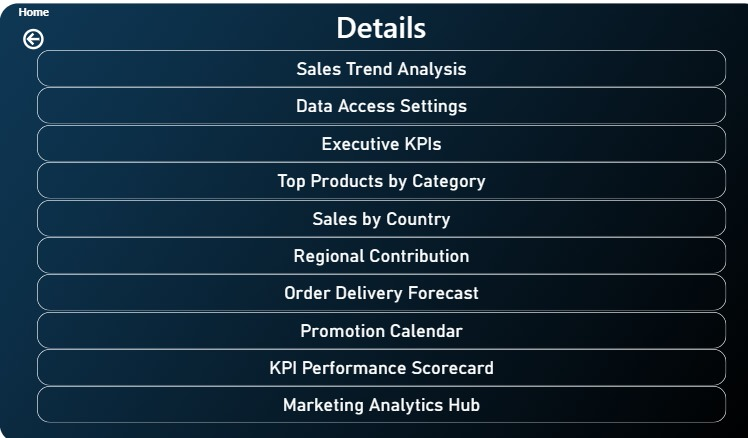

#  Interactive Sales Dashboard (Power BI)

An interactive **Power BI dashboard** designed to analyze sales performance and provide actionable business insights.  
The dashboard focuses on KPIs like Total Sales, Profit, Orders, and Discounts, with drill-down filters for year, product, and region.

---

##  Overview

This project visualizes company-wide sales performance to support strategic decision-making.  
It enables users to:
- Explore key metrics such as revenue, profit, and sales growth.
- Compare product performance across regions and time periods.
- Identify top-performing categories and brands.

---

##  Features

- **Dynamic KPIs:** Total Sales, Profit Margin, Quantity Sold, Average Order Value.  
- **Time Analysis:** Breakdown by Year → Quarter → Month.  
- **Top Products & Brands:** Identify the most profitable items.  
- **Interactive Filters:** Quickly view insights by team or category.  
- **Visual Storytelling:** Clean and intuitive dashboard layout.  
- **Advanced DAX Measures:** Sales Target %, Discount Impact, Profit Ratio.

---

##  Insights

- **Sales Target Achievement:** 90.91%  
- **Top Brand:** Fabrikam with $1.14B profit  
- **Most Profitable Category:** Technology  
- **Top Product:** Proseware Projector Series  
- **Discount Impact:** 1.52% only (showing strong pricing control)

---

##  Charts

| Chart Type | Purpose |
|-------------|----------|
| **KPI Cards** | Show key metrics (Sales, Profit, Orders, etc.) |
| **Line Chart** | Sales trends by Year and Month |
| **Bar Chart** | Top 5 Products and Brands by Profit |
| **Donut Chart** | Profit share by Product Class |
| **Table / Matrix** | Detailed brand-level performance |

---

## 📸 Screenshots

---

## 🧩 Tools & Technologies

- **Power BI Desktop**
- **Power Query**
- **DAX (Data Analysis Expressions)**
- **Excel / CSV Data Source**
- **Data Visualization & Storytelling**

---

